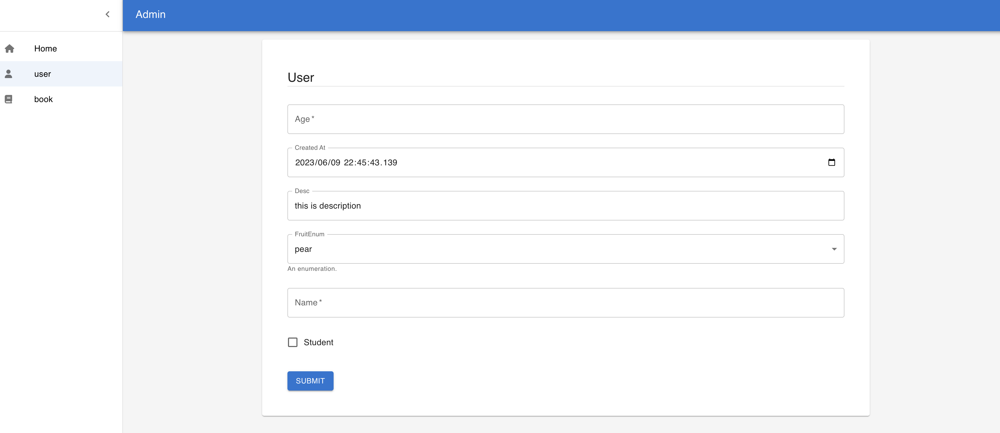

# schema-admin

> **Warning**
>
> Currently, `schema-admin` is still under experimental.

Lightweight schema data model management for Python ecosystem.

Specifically, `schema-admin` provides a management interface for easy previewing, editing, and storing schema data models (defined by [pydantic](https://github.com/pydantic/pydantic) or dataclass).

You just need to define a data model:

```python

class FruitEnum(str, Enum):
    pear = "pear"
    banana = "banana"

class User(BaseSchema):
    name: str
    desc: str = "this is description"
    age: int = Field(..., gt=18, lt=100)
    student: bool
    fruit: FruitEnum = FruitEnum.pear
    created_at: datetime = datetime.now()

    class Config:
        icon = "fa-user"
```

And wow:




LICENSE MIT
